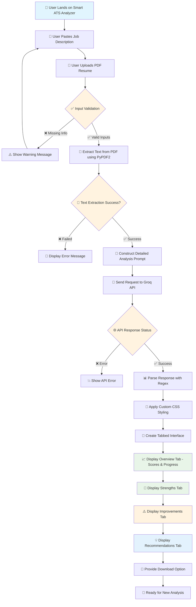
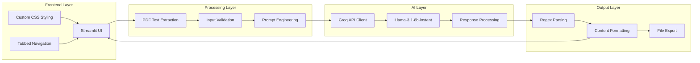

# 📝 Smart ATS Analyzer 🚀

## 🔗 Application Link
[Smart ATS Analyzer](https://smart-resume-assistant-4ztrqstzwr9krvd38d78r8.streamlit.app/)

## 📄 Description
The **Smart ATS (Applicant Tracking System) Analyzer** is a comprehensive Streamlit-based web application designed to help job seekers optimize their resumes against specific job descriptions. Powered by **Groq's Llama-3.1-8b-instant model**, this tool provides detailed, actionable feedback to improve your resume's compatibility with Applicant Tracking Systems and enhance your chances of landing interviews.

Unlike basic keyword matching tools, this analyzer provides professional HR-level insights, personalized recommendations, and a beautiful, user-friendly interface with tabbed navigation for easy consumption of feedback.

---

## ✨ Key Features

### 🎯 **Comprehensive Resume Analysis**
- **ATS Match Score:** Realistic scoring out of 100 based on ATS compatibility
- **JD Match Percentage:** Precise alignment measurement with job requirements
- **Keyword Gap Analysis:** Identifies missing critical terms and skills
- **Strength Recognition:** Highlights existing qualifications that match the role

### 🧠 **AI-Powered Insights**
- **Professional HR Perspective:** 15+ years of recruiting experience simulation
- **Actionable Feedback:** Specific, implementable suggestions for improvement
- **STAR Method Integration:** Guidance on quantifying achievements effectively
- **Industry-Specific Recommendations:** Tailored advice based on job requirements

### 📊 **Interactive Dashboard**
- **Tabbed Interface:** Organized presentation across Overview, Strengths, Improvements, and Recommendations
- **Visual Score Display:** Animated progress bars and gradient-styled score cards
- **Responsive Design:** Clean, professional UI with glassmorphism effects
- **Export Functionality:** Download complete analysis as text file

### 📝 **Personalized Outputs**
- **Custom Professional Summary:** Tailored 3-4 line summary optimized for the specific role
- **Formatting Suggestions:** Consistency and readability improvements
- **Technical Skills Optimization:** Strategic placement and presentation of capabilities

---

## 🤖 Why Groq's Llama-3.1-8b-instant?

This application leverages **Groq's Llama-3.1-8b-instant model** for several key advantages:

- ⚡ **Lightning-Fast Processing:** Groq's inference engine provides near-instantaneous responses
- 🎯 **High Accuracy:** Advanced language understanding for nuanced resume analysis
- 💰 **Cost-Effective:** Efficient processing without compromising quality
- 🔧 **Reliable API:** Stable service with excellent uptime for production use
- 📊 **Structured Output:** Consistent markdown formatting for professional presentation

The model excels at understanding context, providing constructive criticism, and generating human-like professional advice that rivals experienced HR consultants.

---

## 🔄 Application Workflow



---

## 🏗️ Technical Architecture



---

## ⚙️ Installation & Setup

### ✅ Prerequisites
- Python 3.8 or higher
- pip package manager

### 📦 Required Dependencies
```txt
streamlit
PyPDF2
python-dotenv
groq
```

### 🛠️ Installation Steps

1. **Clone the Repository**
   ```bash
   git clone https://github.com/your-username/smart-ats-analyzer.git
   cd smart-ats-analyzer
   ```

2. **Install Dependencies**
   ```bash
   pip install streamlit PyPDF2 python-dotenv groq
   ```

3. **Configure Environment**
   - Create a `.env` file in the project root
   - Add your Groq API key:
     ```env
     GROQ_API_KEY=your_groq_api_key_here
     ```
   - Get your API key from [Groq Console](https://console.groq.com/)

4. **Run the Application**
   ```bash
   streamlit run app.py
   ```

5. **Access the App**
   - Open your browser to `http://localhost:8501`
   - Start analyzing your resume!

---

## 🚀 How to Use

### 📋 Step-by-Step Guide

1. **📄 Input Job Description**
   - Copy and paste the complete job description into the text area
   - Include all requirements, qualifications, and job details

2. **📎 Upload Your Resume**
   - Upload your resume in PDF format only
   - Ensure the PDF contains selectable text (not scanned images)

3. **🔍 Start Analysis**
   - Click the "🔍 Analyze Resume" button
   - Wait for the AI processing to complete

4. **📊 Review Results**
   - **Overview Tab:** View your ATS match score and JD alignment percentage
   - **Strengths Tab:** See what's working well in your resume
   - **Improvements Tab:** Identify missing keywords and critical areas for enhancement
   - **Recommendations Tab:** Get personalized action items and a tailored professional summary

5. **💾 Export Results**
   - Download your complete analysis report
   - Use the recommendations to update your resume

---

## 📁 Project Structure

```
smart-ats-analyzer/
├── 📄 app.py                 # Main Streamlit application
├── 📋 requirements.txt       # Python dependencies
├── 🔐 .env                   # Environment variables (API keys)
├── 📖 README.md             # Project documentation
└── 🎨 assets/               # Static assets (if any)
```

---

## 🎨 UI Features

### 🌈 **Modern Design Elements**
- **Gradient Backgrounds:** Beautiful purple-to-blue gradients
- **Glassmorphism Effects:** Translucent cards with backdrop blur
- **Animated Elements:** Subtle pulse animations for score displays
- **Responsive Layout:** Optimized for different screen sizes

### 📱 **User Experience**
- **Tabbed Navigation:** Organized content consumption
- **Progress Indicators:** Visual feedback during processing
- **Error Handling:** Clear error messages and troubleshooting
- **Loading States:** Spinner animations during analysis

---

## 🔧 Customization Options

### 🎯 **Model Parameters**
- Temperature: 0.3 (balanced creativity and consistency)
- Max Tokens: 4000 (comprehensive responses)
- Model: llama-3.1-8b-instant (optimal speed-quality balance)

### 📝 **Prompt Engineering**
The application uses a carefully crafted prompt that:
- Simulates 15+ years of HR experience
- Provides structured markdown output
- Focuses on actionable, specific feedback
- Balances honesty with constructiveness

---

## 🚧 Future Enhancements

### 📈 **Planned Features**
- 📄 **Multi-format Support:** DOCX, TXT file compatibility
- 🌍 **Multi-language Analysis:** Support for non-English resumes
- 📊 **Historical Tracking:** Save and compare multiple analyses
- 🤝 **LinkedIn Integration:** Direct profile import and analysis
- 📱 **Mobile App:** Native mobile application
- 🎯 **Industry Templates:** Role-specific optimization suggestions

### 🔬 **Technical Improvements**
- 📊 **Analytics Dashboard:** Usage statistics and insights
- 🔒 **Enhanced Security:** Advanced data protection measures
- ⚡ **Performance Optimization:** Faster processing and caching
- 🧪 **A/B Testing:** UI/UX optimization based on user feedback

---

## 🐛 Troubleshooting

### ❓ **Common Issues**

**PDF Not Reading Correctly:**
- Ensure PDF contains selectable text (not scanned images)
- Try a different PDF or recreate from Word document

**API Key Errors:**
- Verify your Groq API key is correctly set in `.env`
- Check API key validity at Groq Console

**Slow Performance:**
- Check internet connection
- Verify Groq API service status

---

## 👩‍💻 About the Developer

Created with ❤️ by **Your Name**

**Connect with me:**
- 🐙 GitHub: [github.com/SimranShaikh20]

---

## 📄 License

This project is licensed under the **MIT License** - see the [LICENSE](LICENSE) file for details.

---

## 🙏 Acknowledgments

- **Groq** for providing fast and reliable AI inference
- **Streamlit** for the amazing web framework
- **PyPDF2** for PDF processing capabilities
- The open-source community for continuous inspiration

---

## ⭐ Support the Project

If this tool helped you land your dream job, consider:
- ⭐ Starring this repository
- 🐛 Reporting bugs or suggesting features


---

**Made with ❤️ for job seekers worldwide** 🌍