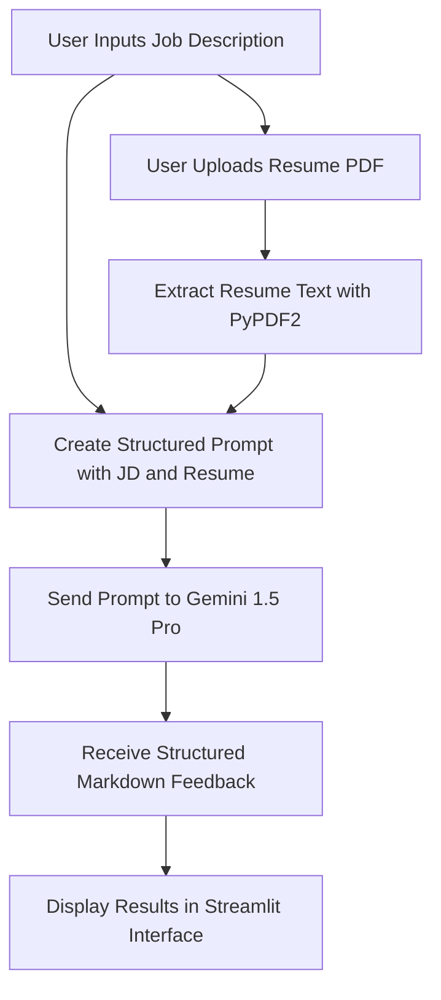

# 📝 Smart ATS Analyzer 🚀

## 🔗 Application Link
[Smart Resume Assistant](https://smart-resume-assistant-4ztrqstzwr9krvd38d78r8.streamlit.app/)

## 📄 Description
The **Smart ATS (Applicant Tracking System)** is a Streamlit-based web application designed to help job seekers optimize their resumes based on a provided Job Description (JD). It uses **Google's Gemini 1.5 Pro model** for advanced resume analysis, providing detailed feedback, keyword recommendations, and a personalized summary.

---

## ✨ Features
- **🔍 Resume Evaluation:** Analyzes your resume against the provided JD.
- **🧠 Gemini AI Feedback:** Utilizes Google's Gemini Pro LLM for professional and constructive analysis.
- **📊 ATS Match Score:** Gives a match score out of 100.
- **📌 Missing Keywords:** Detects missing terms from your resume.
- **💼 Strengths & Improvements:** Highlights key strengths and suggests critical improvements.
- **📝 Summary Suggestions:** Rewrites a tailored professional summary.

---

## 📈 Why Gemini 1.5 Pro?
The **Gemini 1.5 Pro** model by Google was selected due to its advanced reasoning capabilities, fast token processing, and accurate text comprehension. Here's why it's a great fit for our project:

- ✅ **Long Context Support:** Can handle large resume and job description documents with high accuracy.
- ⚡ **Fast Inference:** Provides quick feedback for real-time applications like this.
- 🔍 **Contextual Understanding:** Delivers better results when comparing nuanced resume content with job descriptions.
- 🤝 **Professional Tone:** Generates human-like, recruiter-quality summaries and suggestions.

Gemini's performance ensures resume feedback is not just keyword-based, but also thoughtful and strategically sound.

---

## 🔄 Project Workflow


---

## ⚙️ Installation

### ✅ Prerequisites
- Python 3.8+

### 📦 Libraries Used
- `streamlit`
- `google-generativeai`
- `PyPDF2`
- `python-dotenv`

### 🛠️ Steps
1. Clone the repository:
   ```bash
   git clone <repository_url>
   ```
2. Navigate to the project directory:
   ```bash
   cd smart-ats
   ```
3. Install dependencies:
   ```bash
   pip install -r requirements.txt
   ```
4. Set up your environment:
   - Create a `.env` file in the project root.
   - Add your Google API key (from [Google AI Studio](https://aistudio.google.com/app/apikey)):
     ```env
     GOOGLE_API_KEY=your_api_key_here
     ```
5. Run the app:
   ```bash
   streamlit run app.py
   ```

---

## 🚀 Usage
1. Open the app in your browser.
2. Paste the job description into the text area.
3. Upload your resume in **PDF** format.
4. Click **🔍 Analyze Resume**.
5. Review the detailed markdown-formatted results:
   - **🏆 ATS Match Score**
   - **🔍 JD Match %**
   - **✅ Strengths**
   - **⚠️ Missing Keywords**
   - **📌 Improvements**
   - **💡 Recommendations**
   - **📝 Summary Suggestion**

---

## 📁 Project Structure
```
smart-ats/
├── app.py            # Streamlit app
├── requirements.txt  # Python dependencies
├── .env              # API key
├── README.md         # Project docs
```

## 🔄 Project Workflow


---

## 🧠 How It Works
### 🔐 Input Collection
- User provides:
  - **Job Description**
  - **PDF Resume**

### 📥 Text Extraction
- Extracts resume content using **PyPDF2**.

### 🤖 LLM Interaction
- Combines JD + Resume into a prompt with exact formatting.
- Sends to **Gemini 1.5 Pro** for structured markdown output.

### 📋 Analysis Output
- AI returns markdown with:
  - Match score
  - Matching %
  - Strengths
  - Missing skills
  - Suggestions
  - Custom professional summary

---

## 🚧 Future Enhancements
- 📄 Support for DOCX and TXT
- 🌍 Multilingual Resume Support
- 📤 Exportable Reports
- 🤝 LinkedIn Integration

---

## 👩‍💻 Author
Created with ❤️ by **Simran Shaikh**

---

## 📝 License
Licensed under the **MIT License**.

